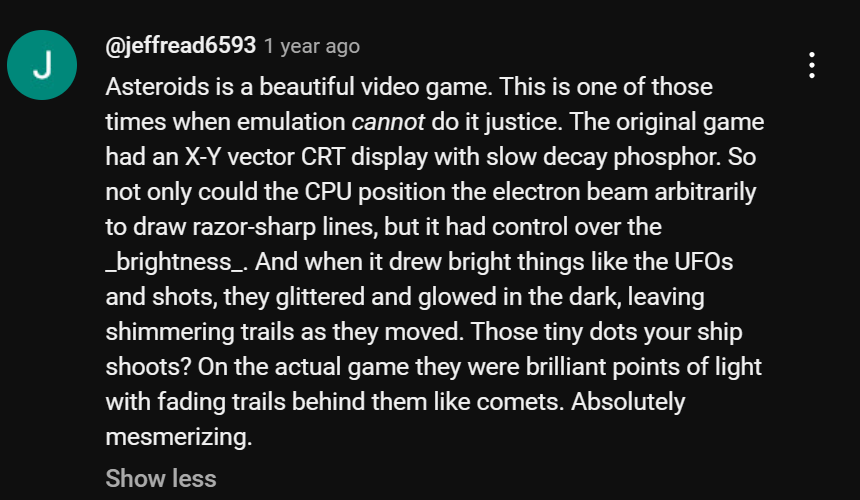
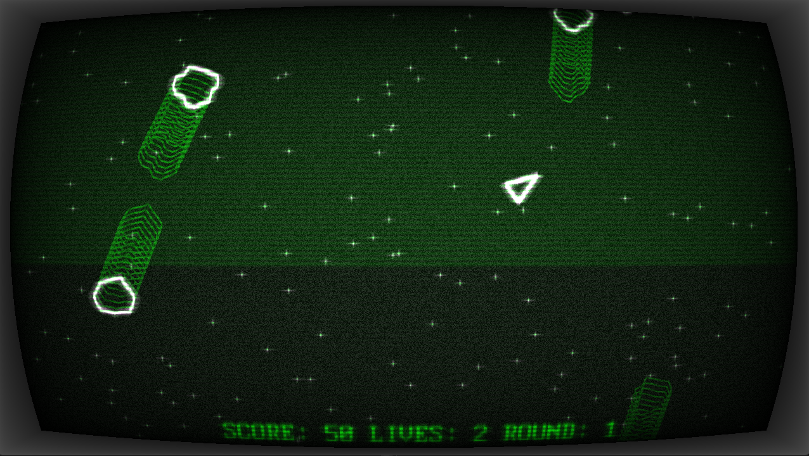

# AsteroidsPlusPlus

An Asteroids clone written in C++ and OpenGL.

Play the Emscripten build [here](https://relativisticmechanic.github.io/asteroidsplusplus/).

# Motivation

The motivation for this project came from this YouTube comment:

Asteroids is a simple enough game that many programmers would have worked as a programming exercise, similar to snake, or tetris. My clone wanted to do something different, at least on the graphical fidelity.

# Gameplay

Use arrow keys / WASD to move the ship around (WS or Up/Down will thrust the ship forward and backward, A/D and Left/Right will change direction), space to shoot a projectile.

# Build

It uses the following libraries:

- SDL2
- SDL2_GPU
- SDL2_Mixer

# Credits

1. MB Music for "Game Over" Theme
2. 8bitbrothers for "Moonlight Sonata, 3rd Movement"
